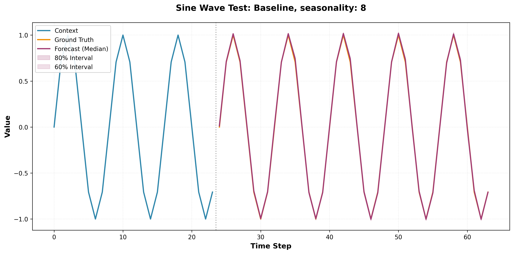
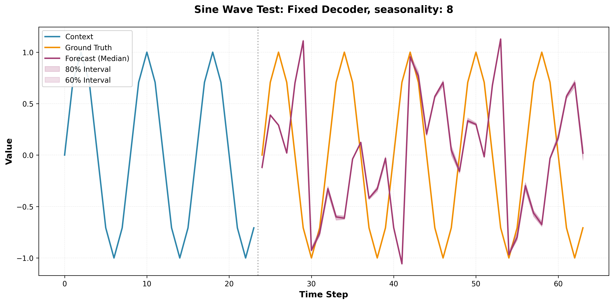
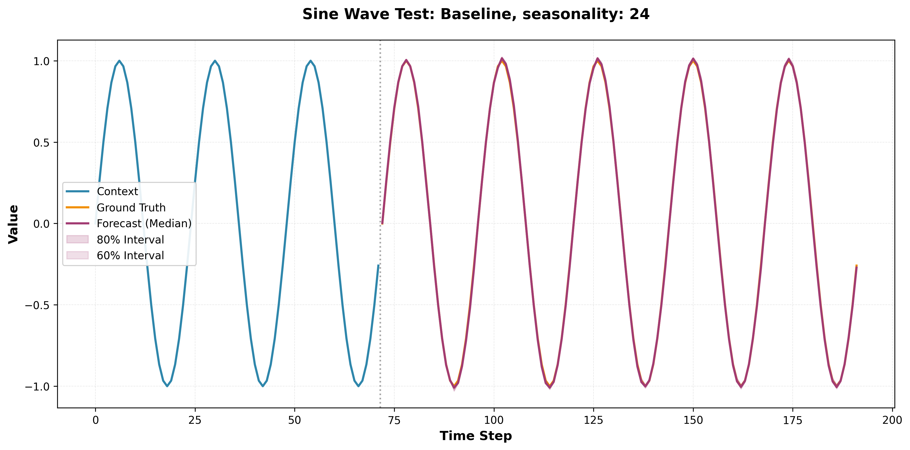
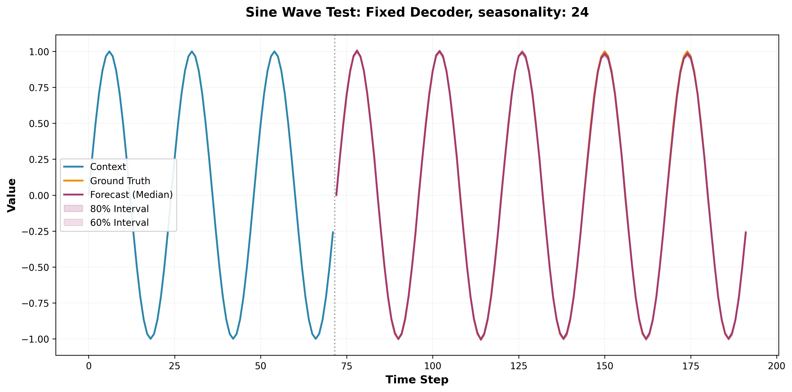
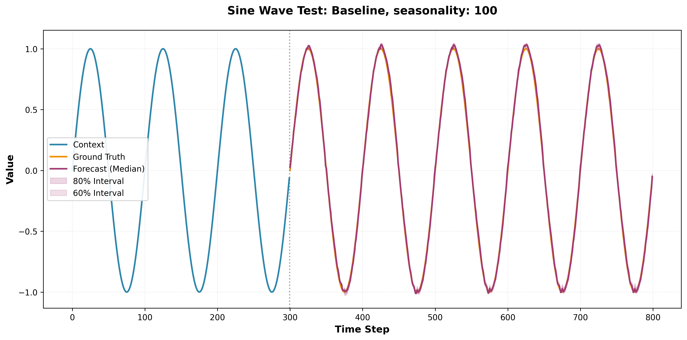
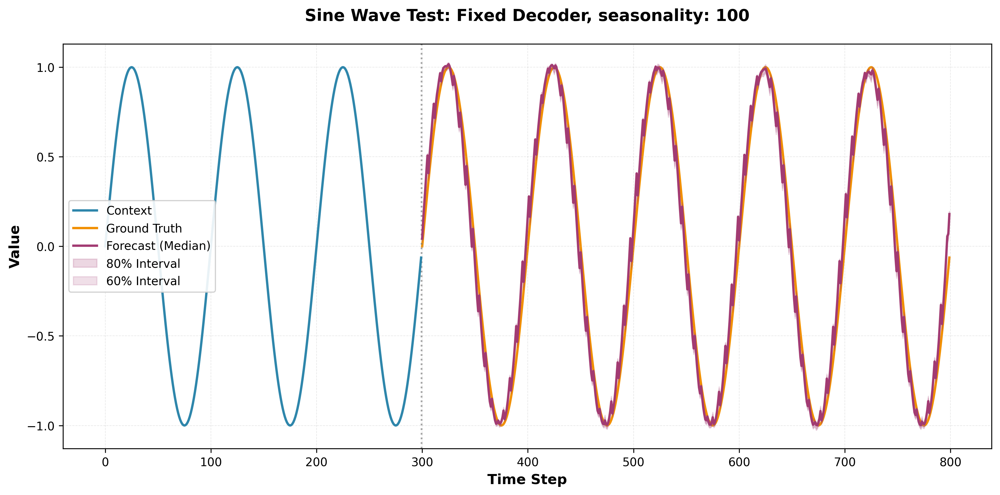
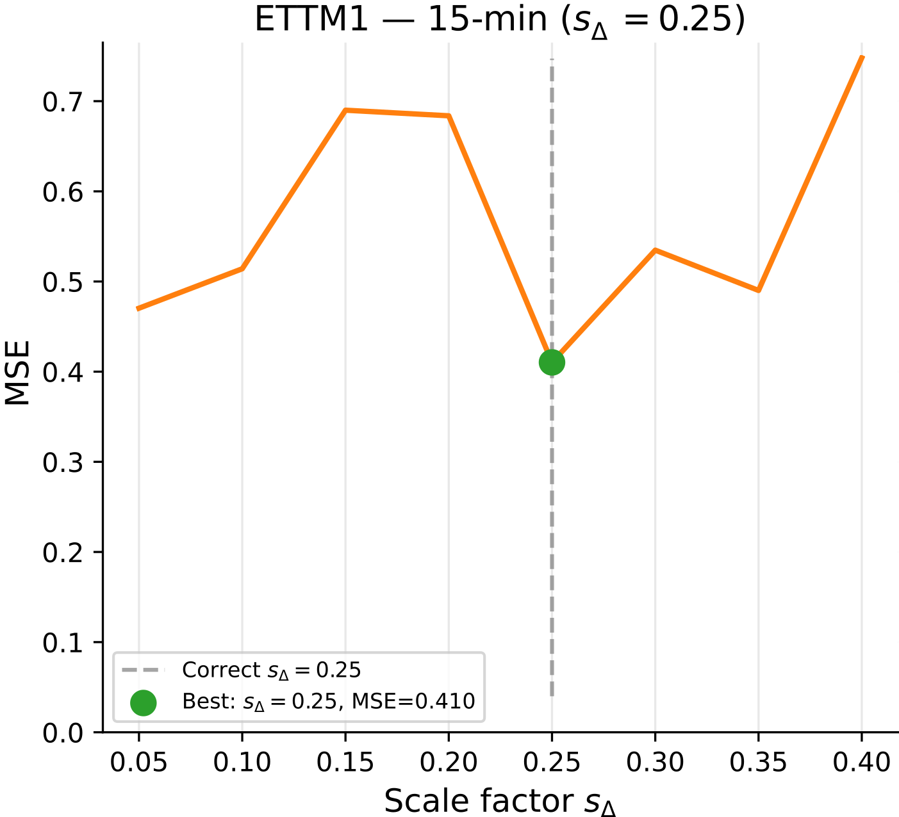
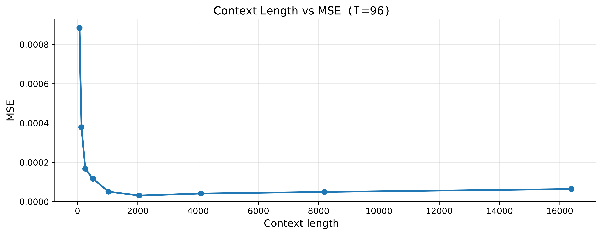
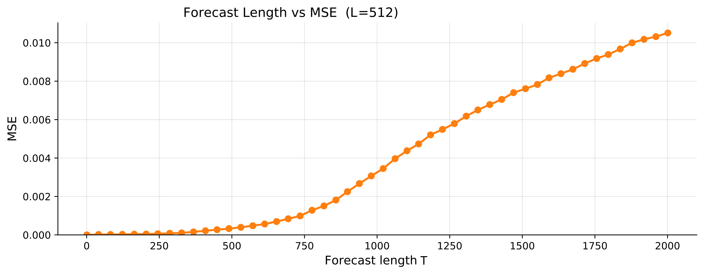

# Additional material for rebuttal

## Improved GIFT-Eval Results
We've extended the context length from 2k to 4k and additionally trained a 18.6M model with a larger MLP. The updated results are shown in the table below.
FlowState is now outperforming both TimesFM-2.5 and TiRex on both MASE and CRPS.

| Model | #Params | MASE ↓ | CRPS ↓ |
|------|---------|--------|--------|
| FlowState-18.6M (4k) | 18.6M | 0.701 | 0.487 |
| FlowState-10M (4k) | 10M | 0.704 | 0.490 |
| TimesFM-2.5 | 200M | 0.705 | 0.490 |
| FlowState-10.6M | 10.6M | 0.712 | 0.493 |
| TiRex | 35M | 0.716 | 0.488 |
| Chronos-2-Synth | 120M | 0.720 | 0.496 |
| FlowState-3M (4k) | 3M | 0.712 | 0.496 |
| FlowState-3M | 3M | 0.725 | 0.502 |
| Kairos-50M | 50M | 0.742 | 0.548 |
| Kairos-23M | 23M | 0.748 | 0.554 |
| Sundial-Base | 128M | 0.750 | 0.559 |
| Toto-Open-Base-1.0 | 151M | 0.750 | 0.517 |

## Performance evaluation on standard datasets
Comparison table of various models on standard time series datasets. The best MAE or MSE values are markd in ***bold*** and second best <u>underlined</u>

| Dataset | Metric | FlowState-10M(4k) | LightGTS-mini | MOIRAI-Large (2024) | iTransformer (2024) | PatchTST (2024) |
|:---|:---:|:---:|:---:|:---:|:---:|:---:|
| ETTm1 | MSE | <u>0.346</u> | ***0.327*** | 0.390 | 0.407 | 0.387 |
| | MAE | ***0.354*** | <u>0.370</u> | 0.389 | 0.410 | 0.400 |
| ETTm2 | MSE | <u>0.258</u> | ***0.247*** | 0.276 | 0.288 | 0.281 |
| | MAE | ***0.299*** | <u>0.316</u> | 0.320 | 0.332 | 0.326 |
| ETTh1 | MSE | <u>0.393</u> | ***0.388*** | 0.510 | 0.454 | 0.469 |
| | MAE | ***0.403*** | <u>0.419</u> | 0.469 | 0.448 | 0.455 |
| ETTh2 | MSE | 0.364 | ***0.348*** | <u>0.354</u> | 0.383 | 0.387 |
| | MAE | <u>0.384</u> | 0.395 | ***0.376*** | 0.407 | 0.407 |
| Traffic | MSE | ***0.381*** | <u>0.561</u> | - | - | - |
| | MAE | ***0.234*** | <u>0.381</u> | - | - | - |
| Weather | MSE | <u>0.211</u> | ***0.208*** | 0.259 | 0.258 | 0.259 |
| | MAE | ***0.236*** | <u>0.256</u> | 0.275 | 0.278 | 0.281 |
| Exchange | MSE | <u>0.349</u> | ***0.347*** | - | - | - |
| | MAE | <u>0.396</u> | ***0.396*** | - | - | - |
| Electricity | MSE | ***0.155*** | 0.213 | 0.188 | <u>0.178</u> | 0.216 |
| | MAE | ***0.240*** | 0.308 | 0.273 | <u>0.270</u> | 0.304 |

## Extended Ablation Results on FlowState-3M (2k context) (GIFT-Eval)

| Model Variant | MASE ↓ | CRPS ↓ |
|--------------|--------|--------|
| **FlowState-3M (baseline)** | **0.725** | **0.502** |
| ± 3 seeds | ± 7e-4 | ± 11e-4 |
|  |  |  |
| *Core Components* |  |  |
| w/o equivariance | 0.799 | 0.553 |
| w/o parallel forecasts | 0.774 | 0.548 |
| w/o time noise | 0.740 | 0.518 |
| w/o causal RevIN (standard RevIN) | 0.738 | 0.513 |
| auto scale factor | 0.746 | 0.521 |
|  |  |  |
| *Encoder Ablations* |  |  |
| w/o output gate | 0.726 | 0.505 |
| S5 real | 0.862 | 0.602 |
| selective Δ_E | 0.749 | 0.521 |
|  |  |  |
| *Decoder Ablations* |  |  |
| fixed FBD (linear decoder) | 0.754 | 0.526 |
| Fourier basis | 0.727 | 0.507 |
| Full-Legendre basis | 0.730 | 0.507 |
|  |  |  |
| *Evaluation Variants* |  |  |
| First 128 basis functions (eval only) | 0.726 | 0.503 |
| First 64 basis functions (eval only) | 0.735 | 0.509 |

Following reviewer feedback, we conducted several additional ablation studies to further isolate and validate the key design choices in FlowState. These new ablations, explained in the rebuttal text are: "w/o time noise", "w/o causal RevIn", "auto scale factor", "fixed FBD (linear decoder)", "First 128 basis functions (eval only)", and "First 64 basis functions (eval only)". The other ablations are the same as in the paper, and shown here for reference.

### Qualitative Analysis of the Fixed Decoder.
**Seasonality 8:**
Whilst FlowState (see Baseline Figure, which uses FlowState-3M (2k)) has no problems dealing with small seasonalities, the fixed decoder ablation breaks down for seasonalities below ~12. 

**Seasonality 24:**
For seasonality of 24, which is abundant in the pretraining corpus, both our FlowState baseline and the fixed decoder ablation perform well. 

**Seasonality 100:**
For larger seasonalities, the FlowState baseline performs well, but for the fixed decoder ablation we can clearly see that the individual patches (of length 24) produced by the decoder are off, whilst the overall shape of the prediction looks good, due to the correctly adjusted SSM encoder.

## Sensitivity analysis
Evaluation of ETTm1 with varying scale factors.

## Failure mode analysis
[Figure8](#variable-L) shows the MSE when forecasting a simple sine wave with a fixed forecasting length and varying context lengths.

[Figure9](#variable-T) shows the MSE when forecasting a simple sine wave with a fixed context lenght and varying forecasting lengths.

